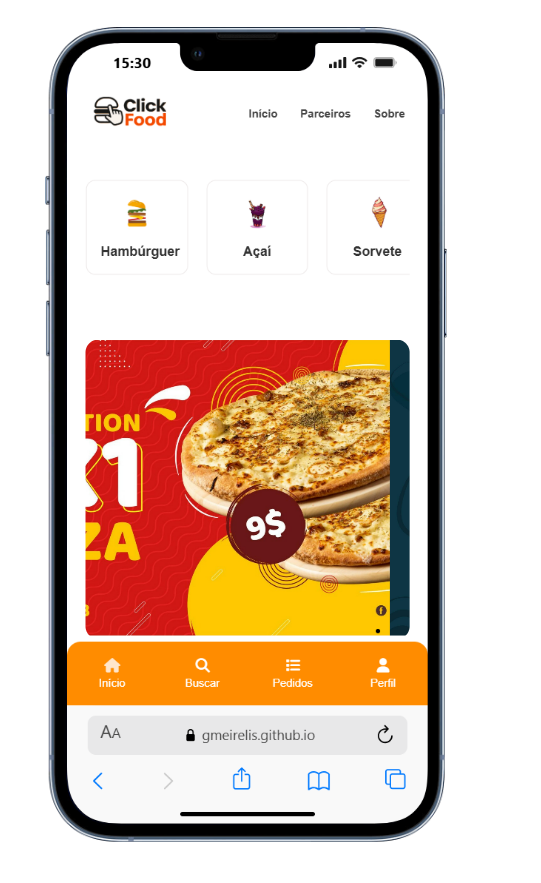

# 🍔 Click iFood
O Click iFood é um projeto de aplicação web inspirado no funcionamento do iFood, desenvolvido com o objetivo de praticar e demonstrar habilidades em desenvolvimento Front-end, consumo de dados e estruturação de interfaces modernas.

# 🚀 Funcionalidades
 - Listagem de restaurantes
 - Exibição de categoria, tempo de entrega e avaliação
 - Navegação para página de cardápio
 - Interface responsiva
 - Estrutura organizada de dados (JSON)
 - Simulação de aplicação de delivery

# 🖥️ Demonstração
  Deploy:
 (https://gmeirelis.github.io/PROJETO-CLICK-FOOD/)

# 📌 Objetivo do Projeto

- Praticar estruturação de projetos Front-end
- Simular aplicações do mundo real
- Trabalhar manipulação de dados

# 🛠️ Tecnologias Utilizadas

- HTML5
- CSS3
- JavaScript (ES6+)
- JSON
- Fetch API (se aplicável)
- GitHub

# 📸 Screenshots

# 🔧 Como Executar o Projeto

Clone o repositório: https://github.com/Gmeirelis/PROJETO-CLICK-FOOD.git

# 📈 Melhorias Futuras

- Filtro por categoria  
- Busca por nome do restaurante  ✅
- Carrinho de compras
- Integração com API  ✅
- Sistema de login

# 👨‍💻 Autor
 Guilherme meireles lima
-Desenvolvidor front-end

/ 🔗 GitHub: https://github.com/seu-usuario

/ 🔗 LinkedIn: www.linkedin.com/in/guimeireleslima

